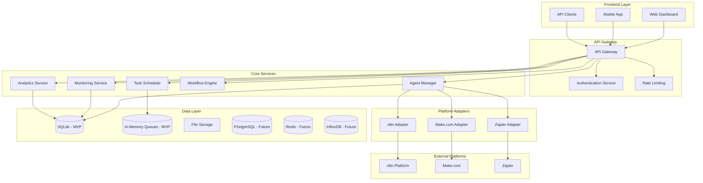

# Cubcen Design Document

## Overview

Cubcen is a centralized AI agent management platform that provides unified control, monitoring, and orchestration of AI agents across multiple automation platforms (n8n, Make.com, Zapier). The system follows a microservices architecture with real-time capabilities, focusing on scalability, reliability, and extensibility.

### Key Design Principles

- **API-First Architecture**: All functionality exposed through RESTful APIs
- **Real-time Communication**: WebSocket connections for live monitoring and updates
- **Platform Agnostic**: Pluggable adapter pattern for different automation platforms
- **Event-Driven**: Asynchronous processing with event sourcing for audit trails
- **Scalable**: Horizontal scaling with containerized microservices
- **Secure**: Basic authentication (MVP) / OAuth 2.0 (Future), RBAC, and encrypted communications
- **Consistent UI**: shadcn/ui components for accessible, consistent design system

### UI Design System

**shadcn/ui Integration**:
- **Component Library**: Pre-built, accessible React components
- **Customizable**: Tailwind CSS-based styling with theme support
- **Type-Safe**: Full TypeScript support with proper prop types
- **Accessible**: ARIA compliance and keyboard navigation built-in
- **Consistent**: Unified design language across all interfaces
- **Developer Experience**: Copy-paste components with easy customization

**Key UI Components for Cubcen**:
- **Dashboard**: Card, Badge, Progress, Alert components for status displays
- **Data Tables**: Table, Pagination for agent lists and task history
- **Forms**: Input, Select, Checkbox, Button for configuration interfaces
- **Navigation**: Tabs, Breadcrumb, Command for user navigation
- **Feedback**: Toast, Dialog, AlertDialog for user notifications
- **Charts**: Integration with Recharts for analytics visualization

### Cubcen Design System

**Brand Colors**:
- **Primary**: `#3F51B5` (Indigo) - Main brand color for buttons, links, and primary actions
- **Secondary**: `#B19ADA` (Light Purple) - Accent color for highlights, badges, and secondary elements
- **Color Palette**:
  ```css
  :root {
    --cubcen-primary: #3F51B5;
    --cubcen-primary-hover: #303F9F;
    --cubcen-primary-light: #7986CB;
    --cubcen-secondary: #B19ADA;
    --cubcen-secondary-hover: #9C7BC7;
    --cubcen-secondary-light: #D1C4E9;
  }
  ```

**Design Tokens**:
- **Typography**: Inter font family for modern, readable interface
- **Spacing**: 8px base unit for consistent spacing system
- **Border Radius**: 6px for subtle rounded corners
- **Shadows**: Subtle elevation with primary color tints
- **Status Colors**: 
  - Success: `#4CAF50` (Green)
  - Warning: `#FF9800` (Orange) 
  - Error: `#F44336` (Red)
  - Info: `#2196F3` (Blue)

**Component Theming**:
- **Buttons**: Primary uses `#3F51B5`, Secondary uses `#B19ADA`
- **Badges**: Status badges use secondary color `#B19ADA` for active states
- **Progress Bars**: Primary color `#3F51B5` for completion indicators
- **Navigation**: Active states use primary color with subtle secondary accents
- **Cards**: Subtle border with secondary color for hover states

## Architecture

### High-Level Architecture



### MVP Architecture Simplifications

For the MVP phase, the architecture will be simplified:
- **Monolithic Backend**: Single Node.js application instead of microservices
- **SQLite Database**: Instead of PostgreSQL for faster setup
- **In-Memory Queues**: Instead of Redis for task scheduling
- **Basic Authentication**: Username/password instead of full OAuth
- **Two Platform Adapters**: n8n and Make.com only

## Components and Interfaces

### 1. Frontend Components

#### Web Dashboard
- **Technology**: React with TypeScript, Next.js, shadcn/ui
- **UI Framework**: shadcn/ui components with Tailwind CSS
- **Key Features**:
  - Real-time agent monitoring dashboard
  - Kanban board for task management
  - Analytics and reporting interface
  - Agent configuration management
  - User management and settings

#### Component Structure
```
src/
├── components/
│   ├── ui/                     # shadcn/ui components
│   │   ├── button.tsx
│   │   ├── card.tsx
│   │   ├── dialog.tsx
│   │   ├── table.tsx
│   │   ├── badge.tsx
│   │   ├── alert.tsx
│   │   ├── progress.tsx
│   │   └── ...
│   ├── dashboard/
│   │   ├── AgentStatusCard.tsx  # Uses Card, Badge, Progress
│   │   ├── RealTimeMetrics.tsx  # Uses Card, Chart components
│   │   └── AlertPanel.tsx       # Uses Alert, Button
│   ├── kanban/
│   │   ├── TaskBoard.tsx        # Uses Card, DragDrop
│   │   ├── TaskCard.tsx         # Uses Card, Badge, Button
│   │   └── TaskDetails.tsx      # Uses Dialog, Form components
│   ├── analytics/
│   │   ├── PerformanceCharts.tsx # Uses Card, Chart components
│   │   ├── ReportGenerator.tsx   # Uses Form, Button, Select
│   │   └── MetricsDashboard.tsx  # Uses Card, Table, Badge
│   └── agents/
│       ├── AgentList.tsx        # Uses Table, Badge, Button
│       ├── AgentConfig.tsx      # Uses Form, Input, Select
│       └── PlatformConnector.tsx # Uses Dialog, Form, Button
├── hooks/
│   ├── useWebSocket.ts
│   ├── useAgentData.ts
│   └── useRealTimeUpdates.ts
├── lib/
│   └── utils.ts                 # shadcn/ui utilities
└── services/
    ├── api.ts
    ├── websocket.ts
    └── auth.ts
```

### 2. Backend Services

#### API Gateway
- **Technology**: Express.js with TypeScript
- **Responsibilities**:
  - Request routing and load balancing
  - Authentication and authorization
  - Rate limiting and throttling
  - Request/response transformation
  - API versioning

#### Agent Manager Service
- **Technology**: Node.js with TypeScript
- **Responsibilities**:
  - Platform connection management
  - Agent discovery and registration
  - Agent metadata storage
  - Health monitoring coordination
  - Configuration management

```typescript
interface AgentManager {
  connectPlatform(config: PlatformConfig): Promise<Connection>
  discoverAgents(platformId: string): Promise<Agent[]>
  registerAgent(agent: Agent): Promise<void>
  updateAgentStatus(agentId: string, status: AgentStatus): Promise<void>
  getAgentHealth(agentId: string): Promise<HealthStatus>
}
```

#### Task Scheduler Service
- **Technology**: Node.js with in-memory queues (MVP) / Bull Queue with Redis (Future)
- **Responsibilities**:
  - Task scheduling and execution
  - Retry logic and error handling
  - Job queue management
  - Workflow orchestration
  - Progress tracking

```typescript
interface TaskScheduler {
  scheduleTask(task: ScheduledTask): Promise<string>
  executeTask(taskId: string): Promise<TaskResult>
  retryFailedTask(taskId: string): Promise<void>
  getTaskStatus(taskId: string): Promise<TaskStatus>
  cancelTask(taskId: string): Promise<void>
}
```

#### Monitoring Service
- **Technology**: Node.js with SQLite storage (MVP) / InfluxDB integration (Future)
- **Responsibilities**:
  - Real-time agent monitoring
  - Performance metrics collection
  - Error tracking and alerting
  - Health check execution
  - Event logging

```typescript
interface MonitoringService {
  trackAgentMetrics(agentId: string, metrics: AgentMetrics): Promise<void>
  logError(error: AgentError): Promise<void>
  checkAgentHealth(agentId: string): Promise<HealthStatus>
  generateAlert(alert: Alert): Promise<void>
  getMetricsHistory(agentId: string, timeRange: TimeRange): Promise<Metrics[]>
}
```

### 3. Platform Adapters

#### Base Adapter Interface
```typescript
interface PlatformAdapter {
  authenticate(credentials: PlatformCredentials): Promise<AuthResult>
  discoverAgents(): Promise<Agent[]>
  getAgentStatus(agentId: string): Promise<AgentStatus>
  executeAgent(agentId: string, params: ExecutionParams): Promise<ExecutionResult>
  subscribeToEvents(callback: EventCallback): Promise<void>
  healthCheck(): Promise<HealthStatus>
}
```

#### n8n Adapter
- **API Integration**: n8n REST API and WebSocket
- **Authentication**: API key or OAuth
- **Capabilities**: Workflow discovery, execution, monitoring

#### Make.com Adapter
- **API Integration**: Make.com REST API
- **Authentication**: OAuth 2.0
- **Capabilities**: Scenario management, execution, monitoring

### 4. Data Models

#### Core Entities

```typescript
interface Agent {
  id: string
  name: string
  platformId: string
  platformType: 'n8n' | 'make' | 'zapier'
  status: 'active' | 'inactive' | 'error' | 'maintenance'
  capabilities: string[]
  configuration: Record<string, any>
  healthStatus: HealthStatus
  createdAt: Date
  updatedAt: Date
}

interface Task {
  id: string
  agentId: string
  workflowId?: string
  status: 'pending' | 'running' | 'completed' | 'failed' | 'cancelled'
  priority: 'low' | 'medium' | 'high' | 'critical'
  scheduledAt: Date
  startedAt?: Date
  completedAt?: Date
  parameters: Record<string, any>
  result?: TaskResult
  error?: TaskError
}

interface Workflow {
  id: string
  name: string
  description: string
  steps: WorkflowStep[]
  status: 'draft' | 'active' | 'paused' | 'archived'
  createdBy: string
  createdAt: Date
  updatedAt: Date
}

interface Platform {
  id: string
  name: string
  type: 'n8n' | 'make' | 'zapier'
  baseUrl: string
  authConfig: AuthConfig
  status: 'connected' | 'disconnected' | 'error'
  lastSyncAt: Date
}
```

## Error Handling

### Error Categories
1. **Platform Connection Errors**: Network issues, authentication failures
2. **Agent Execution Errors**: Runtime errors, timeout issues
3. **Data Validation Errors**: Invalid parameters, schema mismatches
4. **System Errors**: Database failures, service unavailability

### Error Handling Strategy
```typescript
class ErrorHandler {
  handlePlatformError(error: PlatformError): ErrorResponse {
    // Log error with context
    // Determine retry strategy
    // Generate user-friendly message
    // Trigger alerts if critical
  }
  
  handleAgentError(error: AgentError): ErrorResponse {
    // Categorize error type
    // Apply recovery procedures
    // Update agent status
    // Notify stakeholders
  }
}
```

### Recovery Mechanisms
- **Automatic Retry**: Exponential backoff for transient failures
- **Circuit Breaker**: Prevent cascade failures
- **Fallback Procedures**: Alternative execution paths
- **Health Recovery**: Automatic agent restart and reconnection

## Testing Strategy

### Testing Pyramid

#### Unit Tests (70%)
- **Framework**: Jest with TypeScript
- **Coverage**: All business logic, utilities, and pure functions
- **Mocking**: External dependencies and platform APIs
- **Target**: 90% code coverage

#### Integration Tests (20%)
- **Framework**: Jest with Supertest
- **Scope**: API endpoints, database operations, service interactions
- **Environment**: Test database and mock external services
- **Focus**: Data flow and service communication

#### End-to-End Tests (10%)
- **Framework**: Playwright or Cypress
- **Scope**: Critical user journeys and workflows
- **Environment**: Staging environment with real integrations
- **Focus**: User experience and system reliability

### Testing Implementation
```typescript
// Unit Test Example
describe('AgentManager', () => {
  it('should register agent successfully', async () => {
    const mockAgent = createMockAgent()
    const result = await agentManager.registerAgent(mockAgent)
    expect(result).toBeDefined()
    expect(mockDatabase.save).toHaveBeenCalledWith(mockAgent)
  })
})

// Integration Test Example
describe('Agent API', () => {
  it('should create and retrieve agent', async () => {
    const response = await request(app)
      .post('/api/agents')
      .send(mockAgentData)
      .expect(201)
    
    const getResponse = await request(app)
      .get(`/api/agents/${response.body.id}`)
      .expect(200)
    
    expect(getResponse.body.name).toBe(mockAgentData.name)
  })
})
```

### MVP Testing Approach
- **Focus on Core Flows**: Agent registration, monitoring, task execution
- **Manual Testing**: Initial platform integrations and error scenarios
- **Automated CI**: Basic unit and integration tests
- **User Acceptance**: Single customer validation with real workflows

## Performance Considerations

### Scalability Targets
- **Concurrent Users**: 100+ simultaneous users
- **Agent Capacity**: 1000+ agents across platforms
- **Task Throughput**: 10,000+ tasks per hour
- **Response Time**: <200ms for API calls, <2s for dashboard loads

### Optimization Strategies
- **Database Indexing**: Optimized queries for agent and task lookups
- **Caching**: Redis for frequently accessed data
- **Connection Pooling**: Efficient database and HTTP connections
- **Lazy Loading**: Progressive data loading in frontend
- **WebSocket Optimization**: Efficient real-time updates

### Monitoring and Metrics
- **Application Metrics**: Response times, error rates, throughput
- **Infrastructure Metrics**: CPU, memory, disk usage
- **Business Metrics**: Agent utilization, task success rates
- **User Experience**: Page load times, interaction responsiveness

## MVP Essential Features

### 1. Security & Authentication (MVP Critical)

#### Basic Security Implementation
```typescript
// JWT-based authentication
interface AuthService {
  login(credentials: LoginCredentials): Promise<AuthToken>
  validateToken(token: string): Promise<User>
  refreshToken(refreshToken: string): Promise<AuthToken>
  logout(token: string): Promise<void>
}

// Basic RBAC
enum UserRole {
  ADMIN = 'admin',
  OPERATOR = 'operator', 
  VIEWER = 'viewer'
}

interface User {
  id: string
  email: string
  role: UserRole
  permissions: Permission[]
}
```

#### Security Measures
- **JWT Authentication**: Secure token-based auth with refresh tokens
- **Password Hashing**: bcrypt for secure password storage
- **API Rate Limiting**: Basic rate limiting to prevent abuse
- **Input Validation**: Joi/Zod schema validation for all inputs
- **HTTPS Enforcement**: SSL/TLS for all communications
- **Environment Variables**: Secure credential storage

### 2. Logging & Observability (MVP Critical)

#### Structured Logging
```typescript
interface Logger {
  info(message: string, context?: Record<string, any>): void
  warn(message: string, context?: Record<string, any>): void
  error(message: string, error?: Error, context?: Record<string, any>): void
  debug(message: string, context?: Record<string, any>): void
}

// Winston logger configuration
const logger = winston.createLogger({
  level: 'info',
  format: winston.format.combine(
    winston.format.timestamp(),
    winston.format.errors({ stack: true }),
    winston.format.json()
  ),
  transports: [
    new winston.transports.File({ filename: 'logs/error.log', level: 'error' }),
    new winston.transports.File({ filename: 'logs/combined.log' }),
    new winston.transports.Console()
  ]
})
```

#### Health Checks
```typescript
interface HealthCheck {
  name: string
  status: 'healthy' | 'unhealthy' | 'degraded'
  lastCheck: Date
  details?: Record<string, any>
}

// Health check endpoints
app.get('/health', (req, res) => {
  const checks = [
    checkDatabase(),
    checkExternalAPIs(),
    checkMemoryUsage(),
    checkDiskSpace()
  ]
  
  const overallStatus = checks.every(c => c.status === 'healthy') 
    ? 'healthy' : 'unhealthy'
    
  res.status(overallStatus === 'healthy' ? 200 : 503).json({
    status: overallStatus,
    checks,
    timestamp: new Date().toISOString()
  })
})
```

### 3. Configuration Management (MVP Essential)

#### Environment Configuration
```typescript
interface Config {
  port: number
  database: DatabaseConfig
  platforms: PlatformConfig[]
  auth: AuthConfig
  logging: LoggingConfig
  features: FeatureFlags
}

// Feature flags for MVP
interface FeatureFlags {
  enableAnalytics: boolean
  enableKanbanBoard: boolean
  enableWorkflowOrchestration: boolean
  enableAdvancedAuth: boolean
}
```

#### Configuration Validation
```typescript
import Joi from 'joi'

const configSchema = Joi.object({
  port: Joi.number().port().default(3000),
  database: Joi.object({
    path: Joi.string().required(),
    maxConnections: Joi.number().default(10)
  }).required(),
  platforms: Joi.array().items(
    Joi.object({
      name: Joi.string().required(),
      type: Joi.string().valid('n8n', 'make').required(),
      baseUrl: Joi.string().uri().required(),
      credentials: Joi.object().required()
    })
  ).min(1).required()
})
```

### 4. Error Handling & Recovery (MVP Critical)

#### Global Error Handler
```typescript
interface ErrorResponse {
  error: {
    code: string
    message: string
    details?: any
    timestamp: string
    requestId: string
  }
}

// Express error middleware
app.use((error: Error, req: Request, res: Response, next: NextFunction) => {
  const errorId = generateErrorId()
  
  logger.error('Unhandled error', error, {
    requestId: errorId,
    url: req.url,
    method: req.method,
    userAgent: req.get('User-Agent')
  })
  
  const statusCode = error instanceof ValidationError ? 400 : 500
  
  res.status(statusCode).json({
    error: {
      code: error.name,
      message: error.message,
      requestId: errorId,
      timestamp: new Date().toISOString()
    }
  })
})
```

#### Circuit Breaker Pattern
```typescript
class CircuitBreaker {
  private failures = 0
  private lastFailureTime?: Date
  private state: 'closed' | 'open' | 'half-open' = 'closed'
  
  async execute<T>(operation: () => Promise<T>): Promise<T> {
    if (this.state === 'open') {
      if (this.shouldAttemptReset()) {
        this.state = 'half-open'
      } else {
        throw new Error('Circuit breaker is open')
      }
    }
    
    try {
      const result = await operation()
      this.onSuccess()
      return result
    } catch (error) {
      this.onFailure()
      throw error
    }
  }
}
```

### 5. Data Backup & Recovery (MVP Essential)

#### Database Backup Strategy
```typescript
interface BackupService {
  createBackup(): Promise<BackupResult>
  restoreBackup(backupId: string): Promise<void>
  listBackups(): Promise<Backup[]>
  scheduleBackups(schedule: CronSchedule): void
}

// Automated backup implementation
class SQLiteBackupService implements BackupService {
  async createBackup(): Promise<BackupResult> {
    const timestamp = new Date().toISOString().replace(/[:.]/g, '-')
    const backupPath = `backups/cubcen-${timestamp}.db`
    
    await fs.copyFile(this.dbPath, backupPath)
    
    return {
      id: generateId(),
      path: backupPath,
      size: await this.getFileSize(backupPath),
      createdAt: new Date()
    }
  }
}
```

### 6. API Documentation (MVP Essential)

#### OpenAPI/Swagger Integration
```typescript
import swaggerJsdoc from 'swagger-jsdoc'
import swaggerUi from 'swagger-ui-express'

const swaggerOptions = {
  definition: {
    openapi: '3.0.0',
    info: {
      title: 'Cubcen API',
      version: '1.0.0',
      description: 'AI Agent Management Platform API'
    },
    servers: [
      {
        url: process.env.API_BASE_URL || 'http://localhost:3000',
        description: 'Development server'
      }
    ]
  },
  apis: ['./src/routes/*.ts']
}

const specs = swaggerJsdoc(swaggerOptions)
app.use('/api-docs', swaggerUi.serve, swaggerUi.setup(specs))
```

### 7. Basic Monitoring Dashboard (MVP)

#### System Metrics Collection
```typescript
interface SystemMetrics {
  timestamp: Date
  cpu: number
  memory: number
  activeAgents: number
  runningTasks: number
  errorRate: number
  responseTime: number
}

class MetricsCollector {
  private metrics: SystemMetrics[] = []
  
  async collectMetrics(): Promise<SystemMetrics> {
    const metrics = {
      timestamp: new Date(),
      cpu: await this.getCPUUsage(),
      memory: process.memoryUsage().heapUsed / 1024 / 1024,
      activeAgents: await this.getActiveAgentCount(),
      runningTasks: await this.getRunningTaskCount(),
      errorRate: await this.getErrorRate(),
      responseTime: await this.getAverageResponseTime()
    }
    
    this.metrics.push(metrics)
    return metrics
  }
}
```

### MVP Implementation Priority

**Phase 1 (Week 1-2)**:
1. Basic authentication and user management
2. Database setup with SQLite
3. Core API structure with error handling
4. Basic logging and health checks

**Phase 2 (Week 3-4)**:
5. Platform adapter framework
6. n8n integration (read-only)
7. Basic agent discovery and monitoring
8. Simple dashboard with real-time updates

**Phase 3 (Week 5-6)**:
9. Task scheduling and execution
10. Error recovery mechanisms
11. Basic analytics and reporting
12. API documentation and testing

This MVP approach ensures we have a production-ready foundation with essential security, monitoring, and recovery features while keeping the scope manageable.

## Requirements Alignment

### MVP Phase 1 Requirements Coverage
- **Requirement 1**: Platform integration (Tasks 6-8)
- **Requirement 2**: Real-time monitoring (Tasks 9-10, 14)
- **Requirement 3**: Task scheduling (Task 11)
- **Requirement 4**: Error reporting and logging (Tasks 5, 17)
- **Requirement 8**: Health monitoring and recovery (Tasks 5, 9)
- **Requirement 14**: Code quality and CI/CD (All tasks with quality gates)
- **Requirement 15**: Notifications and alerts (Task 18)

### Design System Integration
- **Cubcen Brand Colors**: #3F51B5 (primary), #B19ADA (secondary)
- **shadcn/ui Components**: Consistent, accessible UI components
- **Tailwind CSS**: Custom theme with Cubcen color palette
- **Typography**: Inter font family for modern interface
- **Responsive Design**: Mobile-first approach with consistent breakpoints