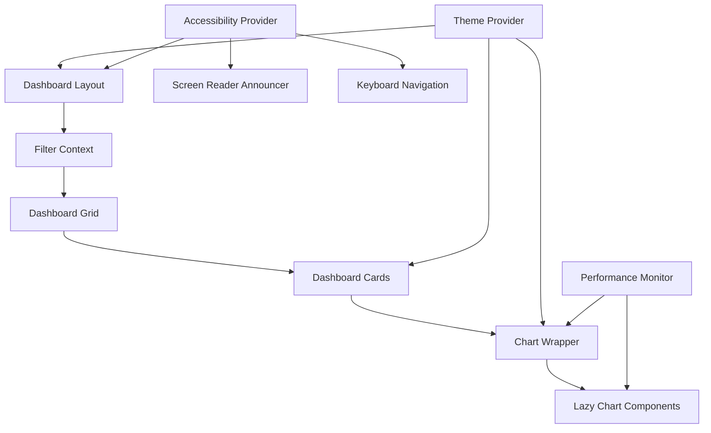

# Design Document

## Overview

This design implements a comprehensive, modular dashboard UI system for the Cubcen AI Agent Management Platform. The system provides a reusable framework with advanced data visualization, comprehensive theming, and full accessibility compliance. It builds upon the existing shadcn/ui component library and Next.js architecture while introducing new patterns for dashboard-specific functionality.

## Architecture

### Component Hierarchy

```
src/components/dashboard/
├── layout/
│   ├── dashboard-layout.tsx          # Main grid-based layout component
│   ├── dashboard-header.tsx          # Header with navigation and user menu
│   ├── dashboard-sidebar.tsx         # Collapsible navigation sidebar
│   ├── dashboard-footer.tsx          # Footer with status and links
│   └── mobile-navigation.tsx         # Bottom navigation for mobile
├── cards/
│   ├── dashboard-card.tsx            # Base card component
│   ├── metric-card.tsx               # KPI and metric display card
│   ├── chart-card.tsx                # Card with integrated chart wrapper
│   └── data-table-card.tsx           # Card with data table
├── charts/
│   ├── chart-wrapper.tsx             # Universal chart container
│   ├── lazy-chart-components.tsx     # Dynamic chart imports
│   ├── chart-types/
│   │   ├── line-chart.tsx            # Line chart component
│   │   ├── bar-chart.tsx             # Bar chart component
│   │   ├── pie-chart.tsx             # Pie chart component
│   │   └── heatmap-chart.tsx         # Heatmap chart component
│   └── chart-controls.tsx            # Chart interaction controls
├── grid/
│   ├── dashboard-grid.tsx            # 12-column responsive grid
│   ├── grid-item.tsx                 # Individual grid item wrapper
│   └── grid-utils.ts                 # Grid calculation utilities
├── theming/
│   ├── theme-provider.tsx            # Enhanced theme context
│   ├── color-palette.tsx             # Color system management
│   └── typography-scale.tsx          # Typography system
├── accessibility/
│   ├── screen-reader-announcer.tsx   # Live region announcements
│   ├── keyboard-navigation.tsx       # Keyboard interaction handler
│   └── focus-management.tsx          # Focus trap and management
└── filters/
    ├── dashboard-filters.tsx         # Global filter state
    ├── filter-context.tsx            # Filter state context
    └── filter-controls.tsx           # Filter UI components
```

### Data Flow Architecture



## Components and Interfaces

### 1. DashboardLayout Component

**File**: `src/components/dashboard/layout/dashboard-layout.tsx`

```typescript
interface DashboardLayoutProps {
  children: React.ReactNode
  header?: React.ReactNode
  sidebar?: React.ReactNode
  footer?: React.ReactNode
  className?: string
  gridAreas?: {
    header: string
    sidebar: string
    main: string
    footer: string
  }
  breakpoints?: {
    mobile: number
    tablet: number
    desktop: number
  }
}

interface GridConfiguration {
  areas: {
    desktop: string
    tablet: string
    mobile: string
  }
  columns: {
    desktop: string
    tablet: string
    mobile: string
  }
  rows: {
    desktop: string
    tablet: string
    mobile: string
  }
}
```

**Features**:

- CSS Grid-based layout with customizable areas
- Responsive breakpoints with smooth transitions
- Collapsible sidebar with state persistence
- Mobile-first responsive design
- Accessibility-compliant landmark regions

### 2. Dashboard Card System

**File**: `src/components/dashboard/cards/dashboard-card.tsx`

```typescript
interface DashboardCardProps {
  title?: string
  subtitle?: string
  icon?: React.ComponentType<{ className?: string }>
  metric?: {
    value: string | number
    unit?: string
    trend?: 'up' | 'down' | 'neutral'
    trendValue?: string
  }
  children?: React.ReactNode
  actions?: React.ReactNode
  loading?: boolean
  error?: string
  className?: string
  size?: 'sm' | 'md' | 'lg' | 'xl'
  priority?: 'low' | 'medium' | 'high' | 'critical'
  interactive?: boolean
  onClick?: () => void
  onFilter?: (filter: FilterValue) => void
}

interface MetricCardProps extends DashboardCardProps {
  metrics: Array<{
    label: string
    value: string | number
    unit?: string
    trend?: 'up' | 'down' | 'neutral'
    trendValue?: string
    color?: string
  }>
  layout?: 'horizontal' | 'vertical' | 'grid'
}

interface ChartCardProps extends DashboardCardProps {
  chartType: 'line' | 'bar' | 'pie' | 'heatmap' | 'area' | 'scatter'
  data: ChartData
  chartConfig?: ChartConfiguration
  exportable?: boolean
  filterable?: boolean
}
```

### 3. Chart System

**File**: `src/components/dashboard/charts/chart-wrapper.tsx`

```typescript
interface ChartWrapperProps {
  type: ChartType
  data: ChartData
  config?: ChartConfiguration
  loading?: boolean
  error?: string
  height?: number
  responsive?: boolean
  interactive?: boolean
  exportable?: boolean
  onDataClick?: (data: ChartDataPoint) => void
  onLegendClick?: (legendItem: LegendItem) => void
  className?: string
}

interface ChartConfiguration {
  colors?: {
    primary: string
    secondary: string
    accent: string
    success: string
    warning: string
    error: string
  }
  legend?: {
    show: boolean
    position: 'top' | 'bottom' | 'left' | 'right'
    align: 'start' | 'center' | 'end'
  }
  tooltip?: {
    show: boolean
    format?: (value: any) => string
    customContent?: React.ComponentType<TooltipProps>
  }
  axes?: {
    x?: AxisConfiguration
    y?: AxisConfiguration
  }
  animations?: {
    enabled: boolean
    duration: number
    easing: string
  }
  responsive?: {
    breakpoints: Record<string, Partial<ChartConfiguration>>
  }
}

type ChartType = 'line' | 'bar' | 'pie' | 'heatmap' | 'area' | 'scatter'

interface ChartData {
  datasets: ChartDataset[]
  labels?: string[]
  metadata?: Record<string, any>
}

interface ChartDataset {
  label: string
  data: ChartDataPoint[]
  color?: string
  type?: ChartType
  options?: Record<string, any>
}

interface ChartDataPoint {
  x?: string | number
  y?: string | number
  value?: string | number
  label?: string
  color?: string
  metadata?: Record<string, any>
}
```

### 4. Grid System

**File**: `src/components/dashboard/grid/dashboard-grid.tsx`

```typescript
interface DashboardGridProps {
  children: React.ReactNode
  columns?: number
  gap?: number
  className?: string
  responsive?: {
    mobile: number
    tablet: number
    desktop: number
  }
  autoFlow?: 'row' | 'column' | 'dense'
  alignItems?: 'start' | 'center' | 'end' | 'stretch'
  justifyItems?: 'start' | 'center' | 'end' | 'stretch'
}

interface GridItemProps {
  children: React.ReactNode
  colSpan?: number | { mobile?: number; tablet?: number; desktop?: number }
  rowSpan?: number | { mobile?: number; tablet?: number; desktop?: number }
  order?: number | { mobile?: number; tablet?: number; desktop?: number }
  className?: string
  priority?: 'low' | 'medium' | 'high' | 'critical'
}
```

### 5. Theme System

**File**: `src/components/dashboard/theming/theme-provider.tsx`

```typescript
interface DashboardTheme {
  colors: {
    primary: string
    secondary: string
    accent: string
    background: string
    surface: string
    text: {
      primary: string
      secondary: string
      disabled: string
    }
    status: {
      success: string
      warning: string
      error: string
      info: string
    }
    chart: {
      palette: string[]
      gradients: Record<string, string>
    }
  }
  typography: {
    fontFamily: {
      sans: string[]
      mono: string[]
    }
    fontSize: {
      xs: string
      sm: string
      base: string
      lg: string
      xl: string
      '2xl': string
      '3xl': string
    }
    fontWeight: {
      normal: number
      medium: number
      semibold: number
      bold: number
    }
    lineHeight: {
      tight: number
      normal: number
      relaxed: number
    }
  }
  spacing: {
    grid: {
      gap: string
      padding: string
      margin: string
    }
    card: {
      padding: string
      margin: string
    }
  }
  breakpoints: {
    mobile: string
    tablet: string
    desktop: string
    wide: string
  }
  animations: {
    duration: {
      fast: string
      normal: string
      slow: string
    }
    easing: {
      ease: string
      easeIn: string
      easeOut: string
      easeInOut: string
    }
  }
}

interface ThemeProviderProps {
  children: React.ReactNode
  theme?: Partial<DashboardTheme>
  defaultTheme?: 'light' | 'dark' | 'system'
  storageKey?: string
  enableColorSchemeDetection?: boolean
  validateContrast?: boolean
}
```

## Data Models

### Filter System

```typescript
interface FilterState {
  dateRange?: {
    start: Date
    end: Date
  }
  categories?: string[]
  status?: string[]
  priority?: string[]
  platforms?: string[]
  agents?: string[]
  customFilters?: Record<string, FilterValue>
}

interface FilterValue {
  type: 'string' | 'number' | 'date' | 'boolean' | 'array'
  value: any
  operator?: 'equals' | 'contains' | 'greaterThan' | 'lessThan' | 'between'
}

interface FilterConfiguration {
  enabled: boolean
  persistent: boolean
  shareable: boolean
  presets?: FilterPreset[]
}

interface FilterPreset {
  id: string
  name: string
  description?: string
  filters: FilterState
  isDefault?: boolean
}
```

### Performance Monitoring

```typescript
interface PerformanceMetrics {
  renderTime: number
  chartLoadTime: number
  dataFetchTime: number
  interactionLatency: number
  memoryUsage: number
  bundleSize: number
}

interface PerformanceThresholds {
  renderTime: number
  chartLoadTime: number
  dataFetchTime: number
  interactionLatency: number
}
```

## Styling & Theming

### CSS Variables System

```css
:root {
  /* Color Palette */
  --dashboard-primary: #3f51b5;
  --dashboard-secondary: #b19ada;
  --dashboard-accent: #ff6b35;
  --dashboard-background: #ffffff;
  --dashboard-surface: #f8f9fa;
  --dashboard-text-primary: #1a1a1a;
  --dashboard-text-secondary: #6b7280;
  --dashboard-text-disabled: #9ca3af;

  /* Status Colors */
  --dashboard-success: #10b981;
  --dashboard-warning: #f59e0b;
  --dashboard-error: #ef4444;
  --dashboard-info: #3b82f6;

  /* Chart Colors */
  --dashboard-chart-1: var(--dashboard-primary);
  --dashboard-chart-2: var(--dashboard-secondary);
  --dashboard-chart-3: var(--dashboard-accent);
  --dashboard-chart-4: var(--dashboard-success);
  --dashboard-chart-5: var(--dashboard-warning);
  --dashboard-chart-6: var(--dashboard-error);
  --dashboard-chart-7: var(--dashboard-info);
  --dashboard-chart-8: #8b5cf6;

  /* Typography Scale */
  --dashboard-text-xs: 0.75rem; /* 12px */
  --dashboard-text-sm: 0.875rem; /* 14px */
  --dashboard-text-base: 1rem; /* 16px */
  --dashboard-text-lg: 1.125rem; /* 18px */
  --dashboard-text-xl: 1.25rem; /* 20px */
  --dashboard-text-2xl: 1.5rem; /* 24px */
  --dashboard-text-3xl: 2rem; /* 32px */

  /* Font Weights */
  --dashboard-font-normal: 400;
  --dashboard-font-medium: 500;
  --dashboard-font-semibold: 600;
  --dashboard-font-bold: 700;

  /* Spacing */
  --dashboard-grid-gap: 1.5rem;
  --dashboard-card-padding: 1.5rem;
  --dashboard-section-margin: 2rem;

  /* Breakpoints */
  --dashboard-mobile: 768px;
  --dashboard-tablet: 1024px;
  --dashboard-desktop: 1280px;

  /* Animations */
  --dashboard-transition-fast: 150ms ease-out;
  --dashboard-transition-normal: 250ms ease-out;
  --dashboard-transition-slow: 350ms ease-out;
}

/* Dark Theme */
[data-theme='dark'] {
  --dashboard-background: #0f172a;
  --dashboard-surface: #1e293b;
  --dashboard-text-primary: #f1f5f9;
  --dashboard-text-secondary: #cbd5e1;
  --dashboard-text-disabled: #64748b;
}
```

### Responsive Grid System

```css
.dashboard-grid {
  display: grid;
  grid-template-columns: repeat(12, 1fr);
  gap: var(--dashboard-grid-gap);
  padding: var(--dashboard-section-margin);
}

@media (max-width: 768px) {
  .dashboard-grid {
    grid-template-columns: 1fr;
    gap: 1rem;
    padding: 1rem;
  }
}

@media (min-width: 769px) and (max-width: 1024px) {
  .dashboard-grid {
    grid-template-columns: repeat(6, 1fr);
  }
}

/* Grid Item Utilities */
.grid-span-1 {
  grid-column: span 1;
}
.grid-span-2 {
  grid-column: span 2;
}
.grid-span-3 {
  grid-column: span 3;
}
.grid-span-4 {
  grid-column: span 4;
}
.grid-span-6 {
  grid-column: span 6;
}
.grid-span-12 {
  grid-column: span 12;
}

@media (max-width: 768px) {
  .grid-span-1,
  .grid-span-2,
  .grid-span-3,
  .grid-span-4,
  .grid-span-6,
  .grid-span-12 {
    grid-column: span 1;
  }
}
```

## Accessibility Implementation

### ARIA Labels and Roles

```typescript
// Screen Reader Announcements
interface AnnouncementProps {
  message: string
  priority: 'polite' | 'assertive'
  delay?: number
}

// Keyboard Navigation
interface KeyboardNavigationProps {
  trapFocus?: boolean
  restoreFocus?: boolean
  initialFocus?: string
  skipLinks?: Array<{
    href: string
    label: string
  }>
}

// Focus Management
interface FocusManagementProps {
  autoFocus?: boolean
  focusOnMount?: boolean
  focusOnUpdate?: boolean
  focusSelector?: string
}
```

### WCAG Compliance Features

- **Color Contrast**: All text meets 4.5:1 contrast ratio
- **Keyboard Navigation**: Full keyboard accessibility with visible focus indicators
- **Screen Reader Support**: Comprehensive ARIA labels and live regions
- **Motion Preferences**: Respects `prefers-reduced-motion`
- **High Contrast Mode**: Support for Windows High Contrast Mode
- **Font Scaling**: Supports up to 200% zoom without horizontal scrolling

## Performance Optimization

### Lazy Loading Strategy

```typescript
// Dynamic Chart Imports
const LineChart = lazy(() => import('./chart-types/line-chart'))
const BarChart = lazy(() => import('./chart-types/bar-chart'))
const PieChart = lazy(() => import('./chart-types/pie-chart'))
const HeatmapChart = lazy(() => import('./chart-types/heatmap-chart'))

// Component Memoization
const MemoizedDashboardCard = memo(DashboardCard, (prevProps, nextProps) => {
  return (
    prevProps.title === nextProps.title &&
    prevProps.loading === nextProps.loading &&
    JSON.stringify(prevProps.data) === JSON.stringify(nextProps.data)
  )
})

// Virtual Scrolling for Large Datasets
interface VirtualizedListProps {
  items: any[]
  itemHeight: number
  containerHeight: number
  renderItem: (item: any, index: number) => React.ReactNode
  overscan?: number
}
```

### Bundle Optimization

- **Code Splitting**: Each chart type is a separate chunk
- **Tree Shaking**: Only used chart components are included
- **Dynamic Imports**: Charts load on demand
- **Image Optimization**: Responsive images with Next.js Image component
- **CSS Optimization**: Critical CSS inlined, non-critical CSS lazy loaded

## Testing Strategy

### Component Testing

```typescript
// Dashboard Card Tests
describe('DashboardCard', () => {
  it('renders with title and metric', () => {
    render(
      <DashboardCard
        title="Test Card"
        metric={{ value: 100, unit: 'items' }}
      />
    )
    expect(screen.getByText('Test Card')).toBeInTheDocument()
    expect(screen.getByText('100 items')).toBeInTheDocument()
  })

  it('handles loading state', () => {
    render(<DashboardCard loading />)
    expect(screen.getByRole('status')).toBeInTheDocument()
  })

  it('supports keyboard navigation', async () => {
    const onFilter = jest.fn()
    render(
      <DashboardCard
        title="Interactive Card"
        interactive
        onFilter={onFilter}
      />
    )

    const card = screen.getByRole('button')
    await user.tab()
    expect(card).toHaveFocus()

    await user.keyboard('{Enter}')
    expect(onFilter).toHaveBeenCalled()
  })
})
```

### Accessibility Testing

```typescript
// Automated Accessibility Tests
describe('Dashboard Accessibility', () => {
  it('meets WCAG 2.1 AA standards', async () => {
    const { container } = render(<DashboardLayout />)
    const results = await axe(container)
    expect(results).toHaveNoViolations()
  })

  it('supports keyboard navigation', async () => {
    render(<DashboardLayout />)

    // Test tab order
    await user.tab()
    expect(screen.getByRole('banner')).toContainElement(document.activeElement)

    await user.tab()
    expect(screen.getByRole('navigation')).toContainElement(document.activeElement)
  })

  it('announces data updates to screen readers', async () => {
    const { rerender } = render(
      <DashboardCard data={[{ value: 100 }]} />
    )

    rerender(<DashboardCard data={[{ value: 200 }]} />)

    expect(screen.getByRole('status')).toHaveTextContent('Data updated')
  })
})
```

### Performance Testing

```typescript
// Performance Benchmarks
describe('Dashboard Performance', () => {
  it('renders within performance budget', async () => {
    const startTime = performance.now()

    render(
      <DashboardLayout>
        <DashboardGrid>
          {Array.from({ length: 20 }).map((_, i) => (
            <DashboardCard key={i} title={`Card ${i}`} />
          ))}
        </DashboardGrid>
      </DashboardLayout>
    )

    const endTime = performance.now()
    expect(endTime - startTime).toBeLessThan(100) // 100ms budget
  })

  it('lazy loads chart components', async () => {
    const { container } = render(
      <ChartCard chartType="line" data={mockData} />
    )

    // Chart should not be loaded initially
    expect(container.querySelector('.recharts-wrapper')).not.toBeInTheDocument()

    // Chart should load after intersection
    await waitFor(() => {
      expect(container.querySelector('.recharts-wrapper')).toBeInTheDocument()
    })
  })
})
```

## Integration with Existing System

### Compatibility with Current Components

The modular dashboard system integrates seamlessly with existing components:

- **shadcn/ui Components**: All dashboard components extend existing UI components
- **Theme System**: Integrates with existing `next-themes` implementation
- **Authentication**: Works with existing `useAuth` hook and permission system
- **API Integration**: Compatible with existing API routes and data fetching patterns

### Migration Strategy

1. **Phase 1**: Implement core dashboard components alongside existing ones
2. **Phase 2**: Gradually migrate existing dashboard pages to use new components
3. **Phase 3**: Deprecate old dashboard components and consolidate theming
4. **Phase 4**: Optimize performance and add advanced features

### Backward Compatibility

- Existing dashboard pages continue to work without modification
- New components provide fallback props for legacy data formats
- Theme variables are additive and don't override existing ones
- API contracts remain unchanged

## Security Considerations

### Data Protection

- **Input Sanitization**: All chart data is sanitized before rendering
- **XSS Prevention**: React's built-in XSS protection plus additional validation
- **Content Security Policy**: Strict CSP headers for chart rendering
- **Data Masking**: Sensitive data can be masked in charts and exports

### Performance Security

- **Resource Limits**: Chart rendering has memory and CPU limits
- **Rate Limiting**: Export functionality is rate-limited
- **Bundle Analysis**: Regular analysis to prevent malicious code injection
- **Dependency Scanning**: Automated scanning of chart library dependencies

This design provides a comprehensive foundation for building sophisticated, accessible, and performant dashboard interfaces while maintaining compatibility with the existing Cubcen platform architecture.
